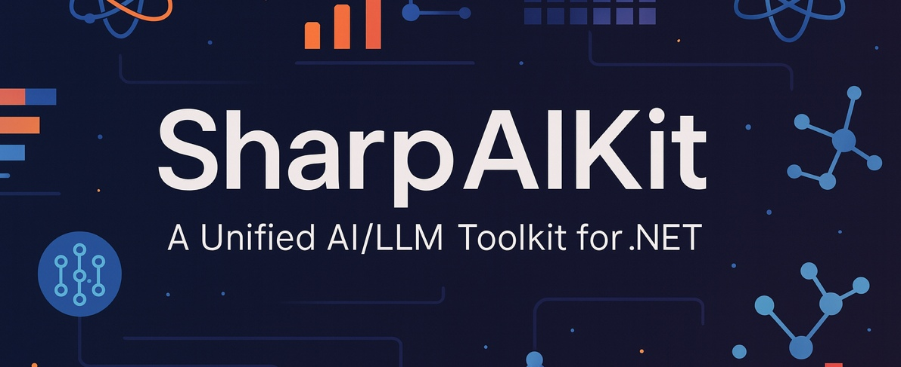

<div align="center">

## SharpAIKit: A Unified AI/LLM Toolkit for .NET


[](https://dotnet.microsoft.com/)
[](LICENSE)
[](https://www.nuget.org/)
[](https://github.com/)

<br/>

**One API, All LLMs** — Supports OpenAI, DeepSeek, Qwen, Mistral, Yi, Groq and any OpenAI-compatible API

**🎯 Killer Features Beyond LangChain:**
- 🔮 **Native C# Code Interpreter** - Execute C# code directly, no Python needed
- 🕸️ **SharpGraph** - Graph orchestration with loops and complex branches
- 🧬 **DSPy Optimizer** - Auto-optimize prompts, gets smarter over time

Package download: https://www.nuget.org/packages/SharpAIKit/
<br/>

---

### 📖 Documentation

<br/>

[](README_EN.md)
[](README_CN.md)

<br/>

---

</div>

## ⚡ Quick Example

```csharp
using SharpAIKit.LLM;

// Works with ANY OpenAI-compatible API
var client = LLMClientFactory.Create("api-key", "https://api.deepseek.com/v1", "deepseek-chat");

// Chat
var response = await client.ChatAsync("Hello!");

// Streaming
await foreach (var chunk in client.ChatStreamAsync("Tell me a story"))
{
    Console.Write(chunk);
}
```

## 📦 Installation

```bash
dotnet add package SharpAIKit
```

## 🌐 Supported Providers

| Provider | URL |
|:---------|:----|
| OpenAI | `https://api.openai.com/v1` |
| DeepSeek | `https://api.deepseek.com/v1` |
| Qwen (Alibaba) | `https://dashscope.aliyuncs.com/compatible-mode/v1` |
| Mistral | `https://api.mistral.ai/v1` |
| Yi (01.AI) | `https://api.lingyiwanwu.com/v1` |
| Groq | `https://api.groq.com/openai/v1` |
| Moonshot (Kimi) | `https://api.moonshot.cn/v1` |
| Ollama (Local) | `http://localhost:11434` |
| **Any OpenAI-compatible** | Custom URL |

---

<div>

**⭐ Star this project if it helps you!**

---

## 🎯 Killer Features Beyond LangChain

### 🔮 Native C# Code Interpreter
**Execute C# code directly using Roslyn - no Python dependency, blazing fast!**

**Why it's killer:** LangChain's Code Interpreter depends on Python, deployment is troublesome and slow. SharpAIKit uses .NET's Roslyn compiler, executes in-memory, extremely fast.

```csharp
using SharpAIKit.CodeInterpreter;

var interpreter = new RoslynCodeInterpreter();

// Math calculation
var result = await interpreter.ExecuteAsync<double>("Math.Pow(3, 5)");
Console.WriteLine($"3^5 = {result}");  // Output: 243

// Fibonacci sequence
var fibCode = """
    var n = 10;
    var fib = new List<int> { 0, 1 };
    for (int i = 2; i < n; i++) {
        fib.Add(fib[i-1] + fib[i-2]);
    }
    string.Join(", ", fib)
    """;
var fibResult = await interpreter.ExecuteAsync(fibCode);
Console.WriteLine(fibResult.Output);  // Output: 0, 1, 1, 2, 3, 5, 8, 13, 21, 34
```

### 🕸️ SharpGraph
**Graph-based orchestration with FSM - handle loops and complex workflows!**

**Why it's killer:** LangChain's Chain is linear (DAG), hard to handle loops. SharpGraph uses Finite State Machine, supports loops and complex branches.

```csharp
using SharpAIKit.Graph;

// Self-correcting loop graph: write code → run → check error → fix → run again
var graph = new SharpGraphBuilder("start", maxIterations: 20)
    .Node("start", async state => {
        state.Set("attempts", 0);
        state.NextNode = "write_code";
        return state;
    })
    .Node("write_code", async state => {
        // Write code logic
        state.NextNode = "execute_code";
        return state;
    })
    .Node("execute_code", async state => {
        // Execute code, handle errors
        state.NextNode = "check_result";
        return state;
    })
    .Node("check_result", async state => {
        // Check if result is valid
        if (valid) state.ShouldEnd = true;
        else state.NextNode = "fix_code";  // Loop back
        return state;
    })
    .Node("fix_code", async state => {
        state.NextNode = "write_code";  // Loop back to retry
        return state;
    })
    .Build();

var result = await graph.ExecuteAsync();
```

### 🧬 DSPy-style Optimizer
**Automatically optimize prompts through iterative improvement!**

**Why it's killer:** LangChain's Prompts are hardcoded, poor effects require manual tweaking. DSPy Optimizer automatically finds the best prompt through iterations.

```csharp
using SharpAIKit.Optimizer;

var optimizer = new DSPyOptimizer(client)
{
    MaxIterations = 10,
    TargetScore = 0.9
};

// Add training examples
optimizer
    .AddExample("What is C#?", "C# is an object-oriented programming language...")
    .AddExample("What is Python?", "Python is an interpreted programming language...");

// Set evaluation metric
optimizer.SetMetric(Metrics.Contains);

// Optimize prompt
var initialPrompt = "Answer questions about programming languages: {input}";
var result = await optimizer.OptimizeAsync(initialPrompt);

Console.WriteLine($"Optimized: {result.OptimizedPrompt}");
Console.WriteLine($"Best score: {result.BestScore:F2}");
// The optimizer automatically adds few-shot examples and improves the prompt!
```

See [中文文档](README_CN.md) or [English Documentation](README_EN.md) for detailed examples.

</div>

---

## 👥 Core Authors

1. **Dustin Dong**
   - Role: Creator & Lead Developer
   - GitHub: https://github.com/dxpython
   - Description: Sole creator of the SharpAIKit framework, responsible for architecture, core modules, RAG engine, agent system, DSPy-style optimizer, multimodal support, and overall ecosystem design.

2. **Evelyn-Liux**  
   - Role: Co-developer  
   - GitHub: https://github.com/Evelyn-Liux  
   - Description: Core collaborator contributing to framework refinement, architectural discussions, and ecosystem development. Recognized as an  co-developer of the SharpAIKit project.
